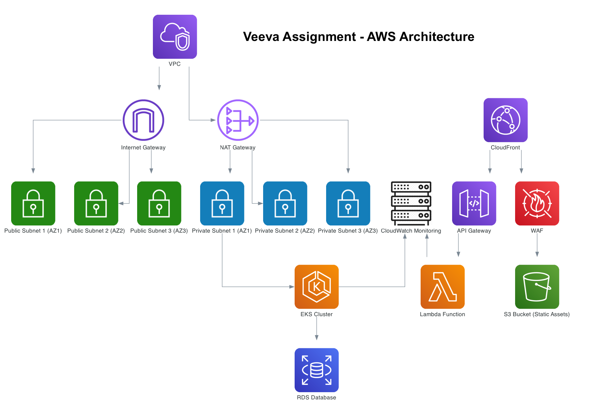

# Veeva Assignment - AWS Architecture Documentation

Welcome to the documentation for the **Veeva Assignment AWS Infrastructure**. This project aims to deliver a comprehensive guide to deploying a secure, scalable, and efficient AWS architecture using Terraform.

## Architecture Overview

The architecture is visually represented in the attached diagram (`AWS_VPC_Architecture.png`), which depicts the key components and their interactions within the AWS environment.

### Key Components:
- **VPC**: The foundational network layer.
- **Public and Private Subnets**: Segregated zones for secure resource deployment.
- **Internet Gateway**: Facilitates internet access for public subnets.
- **NAT Gateway**: Enables internet access for private subnets without exposing them directly.
- **CloudFront**: Content delivery network for low-latency static content distribution.
- **WAF**: Web Application Firewall for enhanced security.
- **EKS Cluster**: Managed Kubernetes cluster for application deployment.
- **RDS**: Relational Database Service for persistent storage.
- **CloudWatch**: Monitoring and observability.
- **Lambda**: Serverless compute for specific tasks.
- **S3 Buckets**: Storage for static assets and logging.

---

## How to Use the Documentation

### Structure
Each module is described in its own `README.md` file and includes:
1. **Resource Details**: Explanation of AWS resources provisioned by the module.
2. **Inputs Table**: Required and optional variables to configure the module.
3. **Outputs Table**: Outputs generated after applying the module.
4. **Example Usage**: Sample Terraform configuration to integrate the module.

---

## Navigating the Documentation

1. **Start with the Diagram**:
   - Familiarize yourself with the architecture by examining the diagram included in this repository: 

2. **Explore Modules**:
   - Each module, such as VPC, CloudFront, WAF, and more, has its own `README.md` file.
   - Review the modules based on the architecture diagram's components to understand their purpose and configuration.

3. **Integrate the Modules**:
   - Use the "Example Usage" section in each module's documentation to integrate it into your Terraform project.

4. **Read the [elaborated information](./main.md) of choices regarding this project.**

5. **An asciinema playback** showing the e-commerce-app in action:
[](https://asciinema.org/a/weP66O5OVZ1xhCRfghygfSbyG)

---

## Example Workflow

### Step 1: Clone the Repository
```bash
git clone https://github.com/geek-kb/veeva_project.git
cd veeva_project
```

### Step 2: Review Documentation
Navigate to the `documentation/` directory to explore individual module details.

### Step 3: Apply Terraform Modules
Follow the example usage and adjust the variables for your environment.

---

## Contributing

If you identify areas for improvement or wish to add more features, feel free to submit a pull request.

---

Thank you for using the Veeva Assignment AWS Infrastructure documentation!
